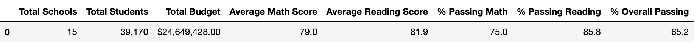
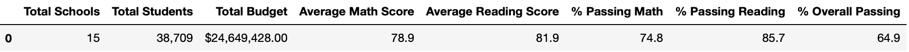
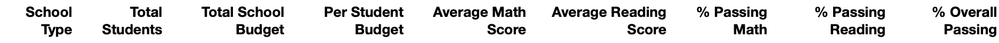
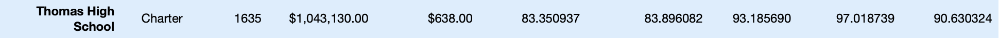

# School_District_Analysis: Cleaning Data and making it more Fancy
## Overview of the School District Analysis
- The purpose of the School District Analysis was the utilization of Python code and Pandas data framing to address an error in data that arose due to academic dishonesty. The academic dishonesty resulted in the cleaning and editing of district data. The edits in School District data code were executed by: 
  - Replacing ninth-grade reading and math scores for students at Thomas High School. 
  - Providing a clean new written report of the School District data. Through analysis and implenting new code, updates were made to the many data summaries in this project. 
  
## Results of the Analysis
- Affects on the District Summary
  - **Before Data Edits**
    - Before cleaning the data, Average Math Score, Average Reading Score, % Passing Math, % Passing Reading, and % Overall Passing were as listed below: 
  - **After Data Edits**
    - After cleaning the data of invalid 9th grade math and reading scores from Thomas High School the Average Math Score, Average Reading Score, % Passing Math, % Passing Reading, and % Overall Passing were updated to: 
  - **Observations** : Upon adminstering a "new_student_count" that took into account the update of removing 9th grade students from Thomas High School from the total student count, a miniscule .1 decline in Average Math Score from 79.0 to 78.9, a .2 decline in % Passing Math from 75.0 to 74.8, a .1 decline in % Passing Reading from  85.8 to 85.7, and % Overall Passing falling .3 from 65.2 to 64.9.

- Affects on the School Summary
  - **Before Data Edits**
    - Before cleaning the data, Average Math Score, Average Reading Score, % Passing Math, % Passing Reading, and % Overall Passing for Thomas High School were as listed below: 
    
    
  -**After Data Edits**
    - After cleaning the data, Average Math Score, Average Reading Score, % Passing Math, % Passing Reading, and % Overall Passing for Thomas High School were updated to: 
    
    
  -**Observations**: Examining the changes in school summary after the exlusion of 9th grade math and reading scores from Thomas Highschool and collecting only the scores from 10th through 12th graders of Thomas High School resulted in the following changes to the data: % Passing Math went from a failing percentage of 66.911315% to 93.185690%, a 26.274375% increase. % Passing Reading was a failing percentage of 69.663609% but changed to a passing percentage of 97.018739%, a 27.35513% increase. Lastly, % Overall Passing went from 65.076453% to 90.630324%, a 25.553871% increase. Replacing 9th graders' math and reading scores for Thomas Highschool resulted in a vast improvement in overall passing percentage as the percent passing in both math and reading scores went up over 20% in both instances.  
