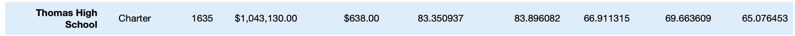

# School_District_Analysis: Cleaning Data and making it more Fancy
## Overview of the School District Analysis
- The purpose of the School District Analysis was the utilization of Python code and Pandas data framing to address an error in data that arose due to academic dishonesty. The academic dishonesty resulted in the cleaning and editing of district data. The edits in School District data code were executed by: 
  - Replacing ninth-grade reading and math scores for students at Thomas High School with NaNs. 
  - Providing a clean new written report of the School District data. Through analysis and implenting new code, updates were made to the many data summaries in this project. 
  
## Results of the Analysis
- **How replacing 9th grade scores affected the District Summary**
  - **Before Data Edits**
    - Before cleaning the data, Average Math Score, Average Reading Score, % Passing Math, % Passing Reading, and % Overall Passing were as listed below: 
  - **After Data Edits**
    - After cleaning the data of invalid 9th grade math and reading scores from Thomas High School the Average Math Score, Average Reading Score, % Passing Math, % Passing Reading, and % Overall Passing were updated to: 
  - **Observations** : Upon adminstering a "new_student_count" that took into account the update of removing 9th grade students from Thomas High School from the total student count, a miniscule .1 decline in Average Math Score from 79.0 to 78.9, a .2 decline in % Passing Math from 75.0 to 74.8, a .1 decline in % Passing Reading from  85.8 to 85.7, and % Overall Passing falling .3 from 65.2 to 64.9.

- **How replacing 9th grade scores affected the School Summary**
  - **Before Data Edits**
    - Before cleaning the data, Average Math Score, Average Reading Score, % Passing Math, % Passing Reading, and % Overall Passing for Thomas High School were as listed below: 
    
    
  -**After Data Edits**
    - After cleaning the data, Average Math Score, Average Reading Score, % Passing Math, % Passing Reading, and % Overall Passing for Thomas High School were updated to: 
    
    
  - **Observations**: Examining the changes in school summary after the exlusion of 9th grade math and reading scores from Thomas Highschool and collecting only the scores from 10th through 12th graders of Thomas High School resulted in the following changes to the data: % Passing Math went from a failing percentage of 66.911315% to 93.185690%, a 26.274375% increase. % Passing Reading was a failing percentage of 69.663609% but changed to a passing percentage of 97.018739%, a 27.35513% increase. Lastly, % Overall Passing went from 65.076453% to 90.630324%, a 25.553871% increase. Replacing 9th graders' math and reading scores for Thomas Highschool resulted in a vast improvement in overall passing percentage as the percent passing in both math and reading scores went up over 20% in both instances. As a result of the immense increase in % Overall Passing from approximately 65% to 90%, Thomas High School relative ranking to the other high schools changed from being in 8th out of 15 highschools to being the 2nd highest % Overall Passing amongst the other high schools.
 
 - **How replacing 9th grade scores affected Scores by Grade***
    - The beginning steps of the School District Analysis involved setting Thomas High School 9th grade math and reading scores' to "NaNs", which would remove those scores from further calculations. As noted earlier, the overall passing percentage saw a 25% positive increase due to the removal of the 9th graders' math and reading scores. This can be explained by the new total Thomas High School studnet count being reduced to 1174 from the previous 1635, and the passing reading and math scores from 10th through 12th grade being exceptional and taking advantage of the loss of much to be assumed poorer grades from the 9th graders. Listed below are data charts for the Math and Reading scores by grade. Average score calculations for Thomas High School were not affected by the 9th grade scores being voided as it seems those scores weren't taken into account due to the NaNs not being counted.
 
 # **Math Scores by Grade**                 
      
 
 # **Reading Scores by Grade**
 
 
 - **How replacing 9th grade scores affected Scores by School Spending**
    - Thomas Highschool with its $638 per student budget, landed in the $630-$644 spending bin. The spending bins categorization took into account average math and reading scores, the percentage passing math and reading, and overall passing percentage. With Thomas Highschool % Passing Math increasing from 66.911315% to 93.185690% and % Passing Reading increasing from  69.663609% to a passing percentage of 97.018739%, the overall Passing percentage thus increased exponentially from 65.076453% to 90.630324%. The results of these increased passing percentages reflect in the Scores by school spending image below as the exclusion of the 9th grade scores result in the improvement of the spending scores of $630-$644 spending bin that Thomas High School resides in. 
